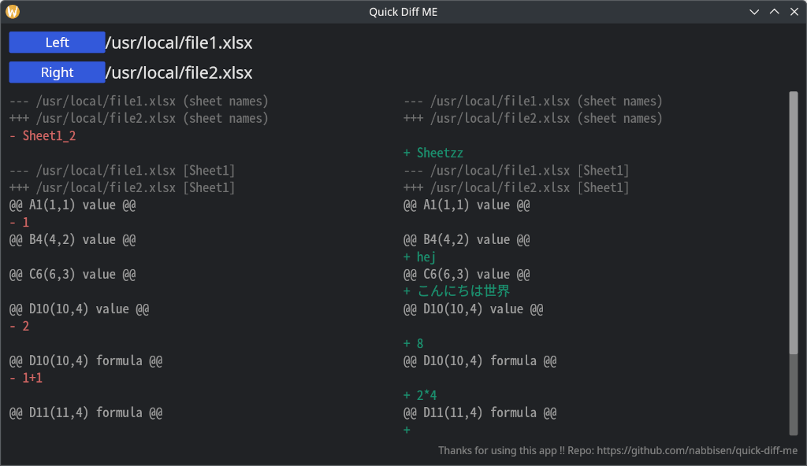

# Quick Diff ME

## Summary

Quick diff viewer to comapre Microsoft Excel files. Difference about sheets (added or removed), cell values and cell formulas will be shown in unified diff format. Written in Rust and dependent on [sheets-diff-rs](https://github.com/nabbisen/sheets-diff-rs) as diff collector.    
Executables supporting cross-platform are available in:

- [Assets](https://github.com/nabbisen/quick-diff-me/releases/latest) in Releases

Microsoft Excel ファイル間の差分簡易ビュアーです。シート増減 / セル値 / 数式 の差分を、Unified Diff 形式で確認できます。 Rust で実装しており、差分取得に [sheets-diff-rs](https://github.com/nabbisen/sheets-diff-rs) を使用しています。    
クロスプラットフォームサポートの実行ファイルをこちらから取得できます:

- Releases の [Assets](https://github.com/nabbisen/quick-diff-me/releases/latest)

### Screenshot

